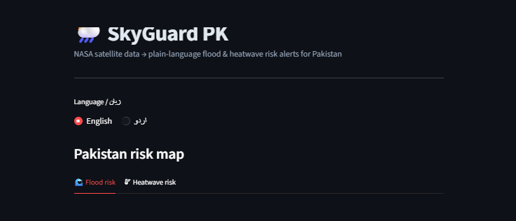
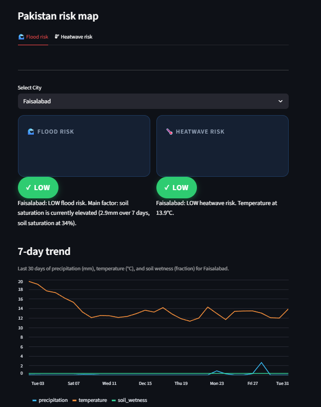
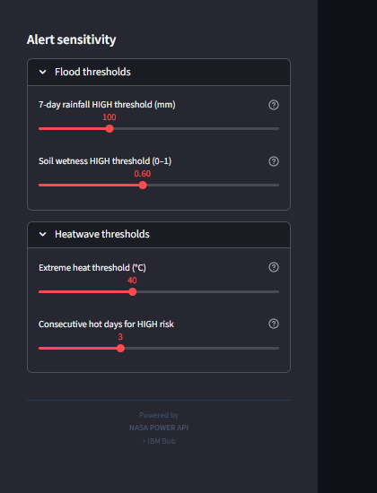

### NASA satellite data → plain-language flood & heatwave risk alerts for Pakistan, in Urdu and English.

*Built for the IBM AI Builders Challenge — August 2026 — Advance Space Exploration with AI*

---

## The Problem

NASA's satellites collect precipitation, temperature, and soil-moisture data over Pakistan **every single day** — data precise enough to flag flood and heatwave risk before it becomes a disaster. But this data lives in raw scientific formats, in English, built for researchers — not for the communities and local authorities who actually need to act on it.

**SkyGuard PK closes that gap.**

---

## What It Does

| | |
|---|---|
| 🛰️ **Pulls** | 5 years of NASA POWER satellite data across 8 major Pakistani cities |
| 🌲 **Predicts** | Flood & heatwave risk using a trained Random Forest model — not just an LLM guessing |
| 🗺️ **Visualizes** | A live, color-coded risk map of Pakistan |
| 🗣️ **Explains** | Every prediction in plain-language, bilingual (Urdu + English) alerts |
| 🎚️ **Lets you explore** | Adjustable sensitivity — while keeping the trained model as the honest default |



*Pakistan risk map — 8 cities color-coded by flood risk. Per-city badge — bilingual plain-language explanation.*



*Alert sensitivity sliders — exploratory view, model remains default.*

---

## Why This Is Different

Most AI-for-space projects in this challenge translate satellite data into text using an LLM. SkyGuard PK's core prediction is a **real trained machine learning model** with measurable, honestly-reported accuracy — the LLM-style explanation layer sits *on top of* that, not instead of it. And it's built for a specific, underserved region and language, not a generic global demo.

---

## Architecture

```
NASA POWER API  →  Feature Engineering  →  Random Forest Classifier
(8 PK cities,       (7-day rolling         (flood risk model +
 5yr history)        rainfall, soil         heatwave risk model)
                      wetness, temp)                │
                                                      ▼
                                    Bilingual plain-language explainer
                                                      │
                                                      ▼
                                    Streamlit dashboard
                                    (map · badges · sliders)
```

**Model:** Random Forest (`class_weight="balanced"` to handle rare HIGH-risk days)

**Performance (from `train_model.py`, real held-out test data):**

| Model | Precision | Recall |
|---|---|---|
| Flood risk | **0.78** | **0.81** |
| Heatwave risk | **0.74** | **0.79** |

*Precision = how often the model's HIGH/MEDIUM predictions were correct. Recall = how often the model successfully caught actual HIGH/MEDIUM risk days.*

**Honest limitation:** Risk thresholds (e.g. 100mm/7-day rainfall, 40°C extreme heat) are self-defined, reasonable approximations from commonly cited regional triggers — not official disaster-management classifications. Disclosed here rather than overstated.

---

## How IBM Bob Was Used

IBM Bob was used for genuine iterative development — not just one-shot code generation:

**1. Edge-case review of risk logic**
Asked Bob to review `label_risk.py`'s threshold logic. Bob surfaced 8 issues, including a high-severity one: humidity was loaded but never used in heatwave classification, despite wet-bulb temperature being the real physiological risk driver in Pakistan's pre-monsoon season.

**2. Pakistan map view**
Asked Bob to add a risk map for all 8 cities. Bob implemented it with Streamlit's native Vega-Lite support — no extra dependency added.

**3. Alert sensitivity sliders**
Asked Bob to add interactive threshold sliders for exploring sensitivity.

**4. Model integrity fix — a design decision I made, Bob implemented**
Reviewing Bob's slider work, I noticed it let sliders silently bypass the trained model — which would misrepresent the project's core claim to any technical reviewer. I directed Bob to make the trained model the default for both the map and per-city badges, with slider-adjusted values only shown when explicitly toggled, and clearly labeled *"Adjusted view — not model prediction."*

This loop — generate → review → catch a flaw → redirect — is the actual workflow, and it's why the model's credibility stays intact even with an interactive slider feature layered on top.

---

## Tech Stack

`Python` · `pandas` · `scikit-learn` · `Streamlit` · `NASA POWER API` · `IBM Bob`

## Setup

See [`RUN_ME_FIRST.md`](./RUN_ME_FIRST.md) for local setup and run instructions.

---

## Impact + Next Steps

**Who this helps:** disaster management authorities, local communities, and students in Pakistan who currently have no accessible, bilingual way to interpret satellite-derived risk data.

**Next steps:**
- Calibrate risk thresholds against real historical disaster records (currently self-defined approximations)
- Expand coverage from 8 cities to national, district-level granularity
- Add SMS/low-bandwidth alert delivery for areas with limited internet access

---

## Selected Challenge Theme

**Advance Space Exploration with AI**

---

**Topics:** `nasa` `streamlit` `machine-learning` `random-forest` `pakistan` `disaster-resilience` `ibm-bob`

---

*Built by Maryam Sohail Ahmed — BS Artificial Intelligence, Dawood University of Engineering & Technology, Karachi*