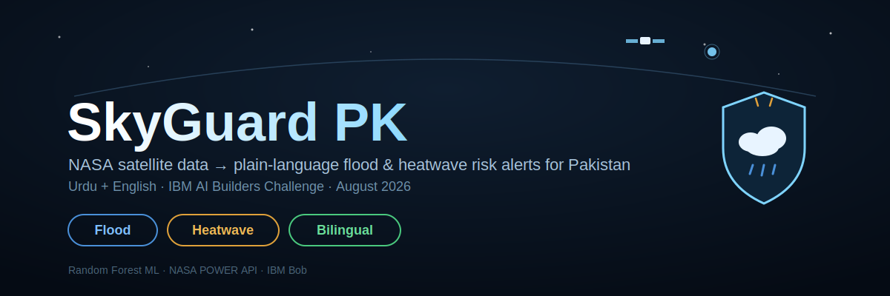
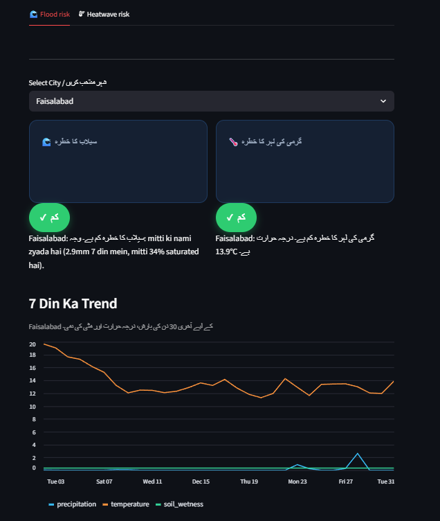
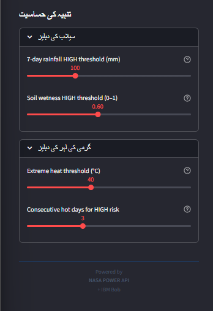

*SkyGuard PK — built for the IBM AI Builders Challenge, turning raw NASA satellite data into usable disaster risk alerts for Pakistan.*

<div align="center">

### 🌦️ NASA satellite data → plain-language flood & heatwave risk alerts for Pakistan, in Urdu and English.

**Built for the IBM AI Builders Challenge · August 2026 · Advance Space Exploration with AI**

`Python` · `scikit-learn` · `Streamlit` · `NASA POWER API` · `IBM Bob`

</div>

---

## The Problem

NASA's satellites collect precipitation, temperature, and soil-moisture data over Pakistan **every single day** — data precise enough to flag flood and heatwave risk before it becomes a disaster. But this data lives in raw scientific formats, in English, built for researchers — not for the communities and local authorities who actually need to act on it.

**SkyGuard PK closes that gap.**

---

## What It Does

| | |
|---|---|
| 🛰️ **Pulls** | 5 years of NASA POWER satellite data across 8 major Pakistani cities |
| 🌲 **Predicts** | Flood & heatwave risk using a trained Random Forest model — not just an LLM guessing |
| 🗺️ **Visualizes** | A live, color-coded risk map of Pakistan |
| 🗣️ **Explains** | Every prediction in plain-language, bilingual (Urdu + English) alerts |
| 🎚️ **Lets you explore** | Adjustable sensitivity — while keeping the trained model as the honest default |


*Pakistan risk map — 8 cities color-coded by flood risk. Per-city badge — bilingual plain-language explanation.*



*The same dashboard, fully in Urdu — card headers, risk badges, and explanations all translate together, not just the explanation text.*


*Alert sensitivity sliders — exploratory view, model remains default.*



*Sidebar controls are fully bilingual too.*

---

## Why This Is Different

Most AI-for-space projects in this challenge translate satellite data into text using an LLM. SkyGuard PK's core prediction is a **real trained machine learning model** with measurable, honestly-reported accuracy — the plain-language explanation layer sits *on top of* that, not instead of it. And it's built for a specific, underserved region and language, not a generic global demo.

---

## Architecture

```
NASA POWER API  →  Feature Engineering  →  Random Forest Classifier
(8 PK cities,       (7-day rolling         (flood risk model +
 5yr history)        rainfall, soil         heatwave risk model)
                      wetness, temp,                │
                      humidity)                      ▼
                                    Bilingual plain-language explainer
                                                      │
                                                      ▼
                                    Streamlit dashboard
                                    (map · badges · sliders)
```

**Model:** Random Forest (`class_weight="balanced"` to handle rare HIGH-risk days)

### Performance — reported honestly, including what the numbers don't mean

| Model | Class | Precision | Recall | Support |
|---|---|---|---|---|
| Flood risk | HIGH | 1.00 | 0.98 | 46 |
| Flood risk | MEDIUM | 1.00 | 1.00 | 1,120 |
| Flood risk | LOW | 1.00 | 1.00 | 1,758 |
| Heatwave risk | HIGH | 0.57 | 0.67 | 6 |
| Heatwave risk | MEDIUM | 0.80 | 0.73 | 11 |
| Heatwave risk | LOW | 1.00 | 1.00 | 2,907 |

**Important honesty note on the flood model's near-perfect score:** the flood risk labels are themselves derived deterministically from `rain_7day` and `soil_wetness` — the same features the model trains on. Near-1.00 scores here mean the model learned the labeling rule correctly, **not** that it can perfectly predict real-world floods with unseen data patterns. This is disclosed rather than presented as validated real-world accuracy.

**Heatwave model note:** more realistic-looking numbers, but the HIGH class has only 6 test examples — too small a sample to treat these scores as statistically reliable. More historical data would be needed to validate further.

**Feature importance (heatwave model) confirms the humidity fix worked:** temperature (0.47) and humidity (0.24) are now the top two drivers, reflecting real wet-bulb heat risk — previously humidity was loaded but unused.

### Threshold calibration — grounded in real 2022 Pakistan flood data

`FLOOD_RAIN_7DAY_MM = 100mm` is an **early-warning threshold**, not a disaster-matching one. It's calibrated with reference to:
- Pakistan's national 30-year average rainfall benchmark: **130.8mm**
- Single-day extreme recorded in Naushahro Feroze, Aug 2022: **142mm**
- Urban flooding threshold observed in Lahore, 2022: **200mm+**

100mm over 7 days is designed to flag *rising* risk before it reaches these disaster-level totals — not to match them after the fact.

---

## How IBM Bob Was Used

IBM Bob was used for genuine iterative development — not just one-shot code generation:

**1. Edge-case review of risk logic**
Asked Bob to review `label_risk.py`'s threshold logic. Bob surfaced 8 issues, including a high-severity one: humidity was loaded but never used in heatwave classification, despite wet-bulb temperature being the real physiological risk driver in Pakistan's pre-monsoon season.

**2. Pakistan map view**
Asked Bob to add a risk map for all 8 cities. Bob implemented it with Streamlit's native Vega-Lite support — no extra dependency added.

**3. Alert sensitivity sliders**
Asked Bob to add interactive threshold sliders for exploring sensitivity.

**4. Model integrity fix — a design decision I made, Bob implemented**
Reviewing Bob's slider work, I noticed it let sliders silently bypass the trained model — which would misrepresent the project's core claim to any technical reviewer. I directed Bob to make the trained model the default for both the map and per-city badges, with slider-adjusted values only shown when explicitly toggled, and clearly labeled *"Adjusted view — not model prediction."*

**5. Humidity gap — closed**
Bob's original edge-case review (entry #1) flagged that humidity was loaded but unused in heatwave classification. Rather than leave this as an open limitation, directed Bob to incorporate humidity as a secondary HIGH-risk trigger, reflecting wet-bulb temperature risk. Retrained and re-verified metrics afterward — feature importance confirms humidity is now genuinely used (0.24 importance, second only to temperature).

**6. Threshold documentation grounded in real data**
Directed Bob to update `label_risk.py`'s documentation to explain the 100mm/7-day threshold with reference to real 2022 Pakistan flood records, rather than leaving it as an unexplained constant.

This iterative process — generate, review, catch a flaw, redirect — reflects how the project treats AI-assisted development: Bob accelerates implementation, but every output was reviewed against what the project actually needed to honestly claim.

---

## Impact + Next Steps

**Who this helps:** disaster management authorities, local communities, and students in Pakistan who currently have no accessible, bilingual way to interpret satellite-derived risk data.

**Next steps:**
- Gather more historical data to validate the heatwave HIGH-risk class more reliably (currently a small sample)
- Expand coverage from 8 cities to national, district-level granularity
- Add SMS/low-bandwidth alert delivery for areas with limited internet access

---

## Tech Stack

`Python` · `pandas` · `scikit-learn` · `Streamlit` · `NASA POWER API` · `IBM Bob`

## Setup

See [`RUN_ME_FIRST.md`](./RUN_ME_FIRST.md) for local setup and run instructions.

---

## Selected Challenge Theme

**Advance Space Exploration with AI**

---

**Topics:** `nasa` `streamlit` `machine-learning` `random-forest` `pakistan` `disaster-resilience` `ibm-bob`

---

<div align="center">

*Built by Maryam Sohail Ahmed — BS Artificial Intelligence, Dawood University of Engineering & Technology, Karachi*

</div>
